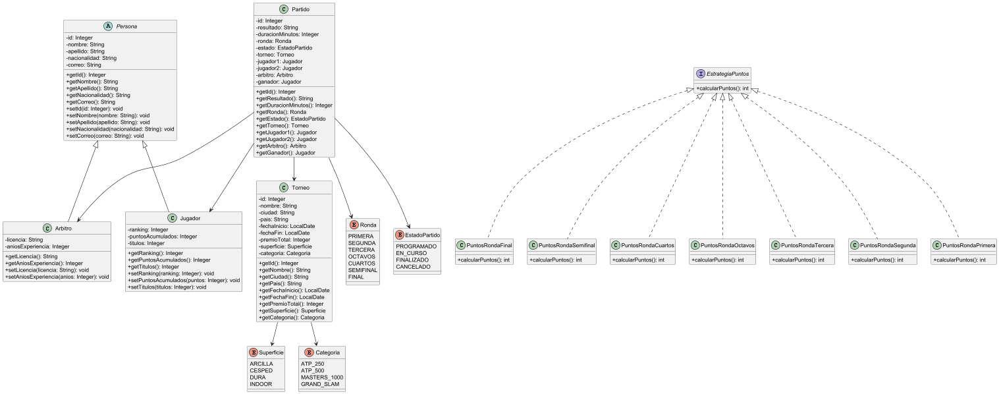
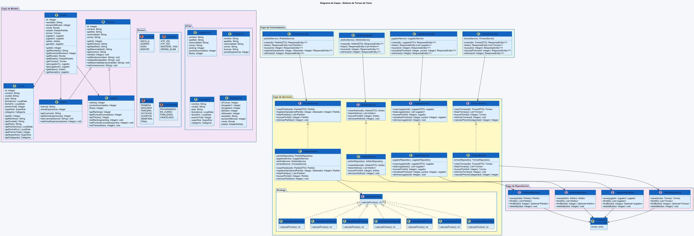

# 🎾 Torneo de Tenis - API REST

Sistema de gestión de torneos de tenis desarrollado con **Spring Boot**, aplicando los principios de **Programación Orientada a Objetos**, patrones de diseño y arquitectura en capas.

---

## 📋 Tabla de Contenidos

- [Descripción del Proyecto](#descripción-del-proyecto)
- [Tecnologías Utilizadas](#tecnologías-utilizadas)
- [Arquitectura del Sistema](#arquitectura-del-sistema)
- [Principios POO Aplicados](#principios-poo-aplicados)
- [Patrones de Diseño](#patrones-de-diseño)
- [Estructura del Proyecto](#estructura-del-proyecto)
- [Requerimientos Funcionales](#requerimientos-funcionales)
- [Requerimientos No Funcionales](#requerimientos-no-funcionales)
- [Endpoints de la API](#endpoints-de-la-api)
- [Diagramas](#diagramas)
- [Instalación y Configuración](#instalación-y-configuración)
- [Desarrollador](#desarrollador)

---

## 📌 Descripción del Proyecto

El **Sistema de Torneo de Tenis** es una API REST que permite gestionar todos los elementos de un torneo de tenis profesional. El sistema permite registrar jugadores, árbitros, torneos y partidos, así como calcular automáticamente los puntos que gana cada jugador según la ronda que alcanza en el torneo.

El sistema aplica conceptos reales del circuito ATP como categorías de torneos (Grand Slam, Masters 1000, ATP 500, ATP 250), superficies de juego (arcilla, césped, dura, indoor) y rondas de eliminación directa.

---

## 🛠️ Tecnologías Utilizadas

| Tecnología | Versión | Uso |
|---|---|---|
| Java | 21 | Lenguaje principal |
| Spring Boot | 4.0.6 | Framework backend |
| Spring Data JPA | 4.0.6 | Persistencia de datos |
| Hibernate | 7.2.7 | ORM |
| PostgreSQL | 17 | Base de datos |
| Maven | 3.x | Gestión de dependencias |
| Lombok | Latest | Reducción de código boilerplate |

---

## 🏗️ Arquitectura del Sistema

El proyecto sigue una **arquitectura en capas** estrictamente definida:

```
┌─────────────────────────────────┐
│     Capa de Controladores       │  ← Recibe peticiones HTTP REST
├─────────────────────────────────┤
│     Capa de Servicios           │  ← Lógica de negocio + Interfaces
├─────────────────────────────────┤
│     Capa de Repositorios        │  ← Acceso a datos (Spring Data JPA)
├─────────────────────────────────┤
│     Capa de Modelo              │  ← Entidades, DTOs y Enums
├─────────────────────────────────┤
│     Base de Datos               │  ← PostgreSQL
└─────────────────────────────────┘
```

---

## 🧩 Principios POO Aplicados

### Herencia
La clase abstracta `Persona` es la base de la jerarquía de herencia. Tanto `Jugador` como `Arbitro` heredan sus atributos comunes (nombre, apellido, nacionalidad, correo), evitando duplicación de código.

```
Persona (abstracta)
├── Jugador  (ranking, puntosAcumulados, titulos)
└── Arbitro  (licencia, aniosExperiencia)
```

### Polimorfismo
El polimorfismo se aplica en dos niveles:
- A través de la herencia de `Persona`, donde `Jugador` y `Arbitro` son tratados como `Persona` cuando se necesita.
- A través del patrón Strategy, donde cada clase de ronda implementa el método `calcularPuntos()` de forma diferente.

### Encapsulamiento
Todos los atributos de las clases son privados y se accede a ellos únicamente a través de getters y setters, protegiendo la integridad de los datos.

### Interfaces
Cada servicio tiene su propia interfaz (`IJugadorService`, `IArbitroService`, `ITorneoService`, `IPartidoService`) que define el contrato que debe cumplir la implementación, desacoplando el controller del service concreto.

---

## 🎯 Patrones de Diseño

### Patrón Repository
Implementado a través de Spring Data JPA. Cada entidad tiene su propio repositorio que extiende `JpaRepository`, proporcionando operaciones CRUD sin necesidad de escribir código adicional.

```java
public interface JugadorRepository extends JpaRepository<Jugador, Integer> {}
```

### Patrón Strategy
Aplicado para el cálculo de puntos según la ronda ganada. En lugar de usar un `switch` con valores hardcodeados, cada ronda tiene su propia clase que implementa la interfaz `EstrategiaPuntos`.

```
EstrategiaPuntos (interfaz)
├── PuntosRondaFinal       → 100 puntos
├── PuntosRondaSemifinal   → 60 puntos
├── PuntosRondaCuartos     → 40 puntos
├── PuntosRondaOctavos     → 20 puntos
├── PuntosRondaTercera     → 15 puntos
├── PuntosRondaSegunda     → 10 puntos
└── PuntosRondaPrimera     → 5 puntos
```

---

## 📁 Estructura del Proyecto

```
torneo-tenis/
├── docs/
│   ├── diagrama-clases.puml
│   └── diagrama-capas.puml
├── images/
│   ├── diagrama-clases.png
│   └── diagrama-capas.png
├── src/main/java/com/torneotenis/torneo_tenis/
│   ├── controller/
│   │   ├── JugadorController.java
│   │   ├── ArbitroController.java
│   │   ├── TorneoController.java
│   │   └── PartidoController.java
│   ├── model/
│   │   ├── Persona.java
│   │   ├── Jugador.java
│   │   ├── Arbitro.java
│   │   ├── Torneo.java
│   │   ├── Partido.java
│   │   ├── dto/
│   │   │   ├── JugadorDTO.java
│   │   │   ├── ArbitroDTO.java
│   │   │   ├── TorneoDTO.java
│   │   │   └── PartidoDTO.java
│   │   └── enums/
│   │       ├── Superficie.java
│   │       ├── Categoria.java
│   │       ├── Ronda.java
│   │       └── EstadoPartido.java
│   ├── repository/
│   │   ├── JugadorRepository.java
│   │   ├── ArbitroRepository.java
│   │   ├── TorneoRepository.java
│   │   └── PartidoRepository.java
│   ├── service/
│   │   ├── IJugadorService.java
│   │   ├── IArbitroService.java
│   │   ├── ITorneoService.java
│   │   ├── IPartidoService.java
│   │   ├── JugadorService.java
│   │   ├── ArbitroService.java
│   │   ├── TorneoService.java
│   │   ├── PartidoService.java
│   │   └── strategy/
│   │       ├── EstrategiaPuntos.java
│   │       ├── PuntosRondaFinal.java
│   │       ├── PuntosRondaSemifinal.java
│   │       ├── PuntosRondaCuartos.java
│   │       ├── PuntosRondaOctavos.java
│   │       ├── PuntosRondaTercera.java
│   │       ├── PuntosRondaSegunda.java
│   │       └── PuntosRondaPrimera.java
│   └── TorneoTenisApplication.java
├── src/main/resources/
│   └── application.properties.example
├── .gitignore
└── pom.xml
```

---

## ✅ Requerimientos Funcionales

| ID | Descripción |
|---|---|
| RF01 | El sistema debe permitir registrar jugadores con nombre, apellido, nacionalidad, correo, ranking, puntos acumulados y títulos. |
| RF02 | El sistema debe permitir registrar árbitros con nombre, apellido, nacionalidad, correo, licencia y años de experiencia. |
| RF03 | El sistema debe permitir registrar torneos con nombre, ciudad, país, fechas, premio total, superficie y categoría. |
| RF04 | El sistema debe permitir registrar partidos asignando torneo, dos jugadores, árbitro, ronda y estado. |
| RF05 | El sistema debe validar que un jugador no pueda jugar contra sí mismo en un partido. |
| RF06 | El sistema debe permitir registrar el ganador de un partido y actualizar automáticamente sus puntos acumulados según la ronda. |
| RF07 | El sistema debe calcular el premio al ganador según la categoría del torneo. |
| RF08 | El sistema debe permitir listar, buscar y eliminar jugadores, árbitros, torneos y partidos. |

---

## 🔒 Requerimientos No Funcionales

| ID | Descripción |
|---|---|
| RNF01 | El sistema debe responder a las peticiones en menos de 3 segundos en condiciones normales de uso. |
| RNF02 | La API debe estar desarrollada en Java con Spring Boot y seguir el patrón de arquitectura en capas. |
| RNF03 | El frontend debe estar desarrollado en Angular siguiendo el patrón MVC. |
| RNF04 | La base de datos debe ser PostgreSQL. |
| RNF05 | El código debe seguir principios de POO: herencia, polimorfismo, encapsulamiento e interfaces. |
| RNF06 | El sistema debe aplicar el patrón de diseño Strategy para el cálculo de puntos por ronda. |

---

## 🌐 Endpoints de la API

### Jugadores — `/jugadores`

| Método | Endpoint | Descripción |
|---|---|---|
| POST | `/jugadores` | Registrar nuevo jugador |
| GET | `/jugadores` | Listar todos los jugadores |
| GET | `/jugadores/{id}` | Buscar jugador por ID |
| PUT | `/jugadores/{id}/puntos?puntos=X` | Actualizar puntos de un jugador |
| DELETE | `/jugadores/{id}` | Eliminar jugador |

### Árbitros — `/arbitros`

| Método | Endpoint | Descripción |
|---|---|---|
| POST | `/arbitros` | Registrar nuevo árbitro |
| GET | `/arbitros` | Listar todos los árbitros |
| GET | `/arbitros/{id}` | Buscar árbitro por ID |
| DELETE | `/arbitros/{id}` | Eliminar árbitro |

### Torneos — `/torneos`

| Método | Endpoint | Descripción |
|---|---|---|
| POST | `/torneos` | Registrar nuevo torneo |
| GET | `/torneos` | Listar todos los torneos |
| GET | `/torneos/{id}` | Buscar torneo por ID |
| GET | `/torneos/{id}/premio` | Calcular premio al ganador según categoría |
| DELETE | `/torneos/{id}` | Eliminar torneo |

### Partidos — `/partidos`

| Método | Endpoint | Descripción |
|---|---|---|
| POST | `/partidos` | Registrar nuevo partido |
| GET | `/partidos` | Listar todos los partidos |
| GET | `/partidos/{id}` | Buscar partido por ID |
| PUT | `/partidos/{id}/ganador?idGanador=X` | Registrar ganador y actualizar puntos |
| DELETE | `/partidos/{id}` | Eliminar partido |

---

## 📊 Diagramas

### Diagrama de Clases


### Diagrama de Capas


---

## ⚙️ Instalación y Configuración

### Prerrequisitos
- Java 21
- Maven 3.x
- PostgreSQL 17
- IntelliJ IDEA

---

### ⚠️ Importante — Por qué no existe `application.properties` en el repositorio

Por razones de seguridad, el archivo `application.properties` **no está incluido en este repositorio**. Este archivo contiene información sensible como credenciales de la base de datos (usuario y contraseña), por lo que fue agregado al `.gitignore` para evitar que se suba accidentalmente a GitHub y quede expuesto públicamente.

En su lugar, se incluye el archivo `application.properties.example` que contiene la estructura exacta del archivo con valores de ejemplo. **Cualquier persona que clone este repositorio deberá crear su propio `application.properties`** siguiendo los pasos descritos a continuación.

---

### Pasos para configurar y ejecutar el proyecto localmente

1. Clona el repositorio:
```bash
git clone https://github.com/dramirezdlp99/torneo-tenis-api-poo.git
```

2. Crea la base de datos en PostgreSQL:
```sql
CREATE DATABASE torneo_tenis;
```

3. Dentro del proyecto navega a `src/main/resources/` y crea manualmente un archivo llamado exactamente `application.properties` (sin extensión adicional).

4. Copia el contenido del archivo `application.properties.example` que está en la misma carpeta y pégalo en tu nuevo `application.properties`.

5. Reemplaza los valores con tus credenciales reales de PostgreSQL:
```properties
spring.application.name=torneo-tenis
spring.datasource.url=jdbc:postgresql://localhost:5432/torneo_tenis
spring.datasource.username=postgres
spring.datasource.password=TU_CONTRASEÑA_DE_POSTGRES
spring.datasource.driver-class-name=org.postgresql.Driver
spring.jpa.database-platform=org.hibernate.dialect.PostgreSQLDialect
spring.jpa.hibernate.ddl-auto=update
spring.jpa.show-sql=true
spring.jpa.properties.hibernate.format_sql=true
server.port=9096
```

> 💡 **Nota:** El valor `spring.jpa.hibernate.ddl-auto=update` hace que Hibernate cree automáticamente las tablas en la base de datos al arrancar la aplicación por primera vez. No es necesario crear las tablas manualmente.

6. Ejecuta el proyecto desde IntelliJ con el botón de play, o con Maven:
```bash
./mvnw spring-boot:run
```

7. La API estará disponible en:
```
http://localhost:9096
```

---

### ☁️ Configuración con Base de Datos en la Nube *(Sujeto a cambios)*

> **Nota:** Esta sección aplica si en algún momento se decide migrar la base de datos a un servicio en la nube como **Render**, **Railway**, **Supabase** o cualquier otro proveedor de PostgreSQL en la nube. En ese caso el proceso de instalación se simplifica considerablemente porque no sería necesario instalar PostgreSQL localmente.

Si se usa una base de datos en la nube, el `application.properties` cambiaría así:

```properties
spring.application.name=torneo-tenis
spring.datasource.url=jdbc:postgresql://HOST_DE_LA_NUBE:5432/NOMBRE_BD
spring.datasource.username=USUARIO_NUBE
spring.datasource.password=CONTRASEÑA_NUBE
spring.datasource.driver-class-name=org.postgresql.Driver
spring.jpa.database-platform=org.hibernate.dialect.PostgreSQLDialect
spring.jpa.hibernate.ddl-auto=update
spring.jpa.show-sql=true
spring.jpa.properties.hibernate.format_ssl=true
spring.datasource.hikari.ssl=true
server.port=9096
```

Los valores de `HOST_DE_LA_NUBE`, `NOMBRE_BD`, `USUARIO_NUBE` y `CONTRASEÑA_NUBE` los proporciona el servicio en la nube en su panel de configuración bajo la sección **Connection String** o **Database URL**.

> ⚠️ **Importante:** Si se usa base de datos en la nube, las credenciales siguen siendo sensibles y el `application.properties` **nunca debe subirse al repositorio**. El proceso de creación manual del archivo sigue siendo el mismo.

---

## 👨‍💻 Desarrollador

**David Fernando Ramírez de la Parra**

- 📚 Materia: Programación Orientada a Objetos
- 🏫 Facultad de Ingeniería — Ingeniería de Software
- 🎓 Universidad Cooperativa de Colombia